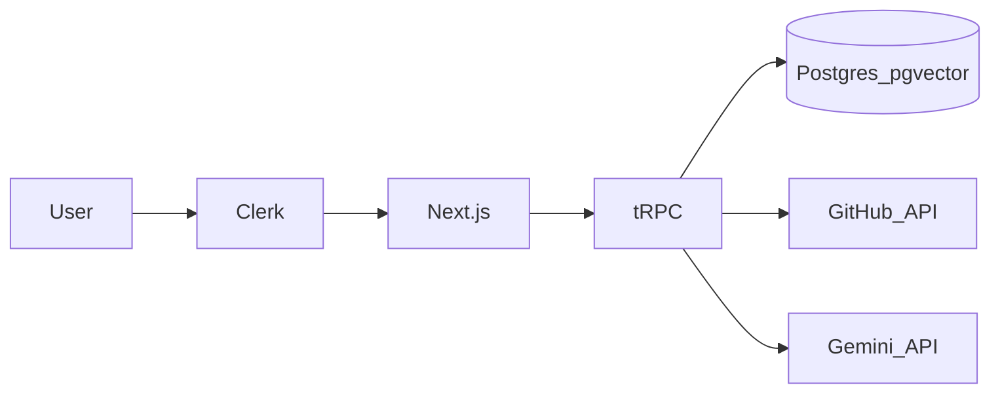

# Aicarus

**Intelligent code assistance, simplified.** Aicarus connects to your GitHub repositories, indexes the codebase with embeddings, summarizes commits with AI, and answers questions about your code - while your team collaborates on shared projects.

## Features

- **GitHub projects** - Create a project from a repository URL; the server clones metadata, indexes source, and stores vector embeddings for retrieval.
- **Commit log** - Fetches recent commits and stores AI-generated summaries.
- **Q&A** - Ask natural-language questions about the indexed codebase; save answers and file references for later.
- **Authentication** - [Clerk](https://clerk.com/) handles sign-in.
- **Team access** - Invite others via join links (`/join/[projectId]`).

## Tech stack

| Area | Choice |
|------|--------|
| App | [Next.js 15](https://nextjs.org/) (App Router), React 19 |
| API | [tRPC v11](https://trpc.io/) |
| Database | [Prisma](https://www.prisma.io/) + PostgreSQL with [pgvector](https://github.com/pgvector/pgvector) |
| Auth | [Clerk](https://clerk.com/) (`@clerk/nextjs`) |
| AI | Google Gemini (`GEMINI_API_KEY`), [Vercel AI SDK](https://sdk.vercel.ai/) / related packages |
| GitHub | [Octokit](https://github.com/octokit/octokit.js) |
| UI | Tailwind CSS 4, Radix-based components (`src/components/ui`) |


## Architecture (high level)



## Prerequisites

- **Node.js** - Minimum version 20.0.0.
- **PostgreSQL** with the **`vector` extension** enabled (required by `prisma/schema.prisma` for embeddings). See the [pgvector installation guide](https://github.com/pgvector/pgvector#installation).

## Local setup

1. Clone the repository and install dependencies:

   ```bash
   npm install
   ```

2. Copy environment variables and fill in secrets:

   ```bash
   cp .env.example .env
   ```

   See [Environment variables](#environment-variables) below.

3. Create the database and apply migrations (the `db:generate` script runs `prisma migrate dev`):

   ```bash
   npm run db:generate
   ```

4. Start the dev server:

   ```bash
   npm run dev
   ```

   Open [http://localhost:3000](http://localhost:3000) (or the port shown in the terminal).

## Environment variables

| Variable | Required | Purpose |
|----------|----------|---------|
| `DATABASE_URL` | Yes | PostgreSQL connection URL (with pgvector available). Validated in `src/env.js`. |
| `NEXT_PUBLIC_CLERK_PUBLISHABLE_KEY` | Yes | Clerk publishable key. |
| `CLERK_SECRET_KEY` | Yes | Clerk secret key. |
| `NEXT_PUBLIC_CLERK_SIGN_IN_URL` | Yes | e.g. `/sign-in` |
| `NEXT_PUBLIC_CLERK_SIGN_UP_URL` | Yes | e.g. `/sign-up` |
| `NEXT_PUBLIC_CLERK_SIGN_UP_FORCE_REDIRECT_URL` | Yes | e.g. `/sync-user` - syncs Clerk user into Prisma after sign-up. |
| `GEMINI_API_KEY` | Yes | Google Gemini API key for summaries and Q&A. |
| `GITHUB_ACCESS_TOKEN` | Recommended | Default token for repo indexing in `src/lib/github-loader.ts` when the user does not supply a per-project token. |

## npm scripts

| Script | Description |
|--------|-------------|
| `npm run dev` | Next.js dev server with Turbopack. |
| `npm run build` | Production build. |
| `npm run start` | Run production server (after `build`). |
| `npm run preview` | Build then start locally. |
| `npm run check` | Lint + TypeScript check. |
| `npm run lint` / `npm run lint:fix` | ESLint. |
| `npm run typecheck` | `tsc --noEmit`. |
| `npm run format:check` / `npm run format:write` | Prettier. |
| `npm run db:generate` | `prisma migrate dev` - create/apply migrations in development. |
| `npm run db:migrate` | `prisma migrate deploy` - apply migrations in production. |
| `npm run db:push` | `prisma db push` - push schema without migrations (use with care). |
| `npm run db:studio` | Open Prisma Studio. |

`postinstall` runs `prisma generate` automatically after `npm install`.

## Deployment

- Deploy the Next.js app to a host that supports Node (e.g. [Vercel](https://vercel.com/)).
- Use a managed PostgreSQL instance that supports **pgvector** (for example Neon, Supabase with the vector extension, or self-hosted Postgres + pgvector).
- Set all production environment variables in the host dashboard; configure Clerk production URLs and allowed origins to match your deployment domain.

## License

[MIT](LICENSE)

---

Made with care by [Mridul](https://github.com/mridxl).
